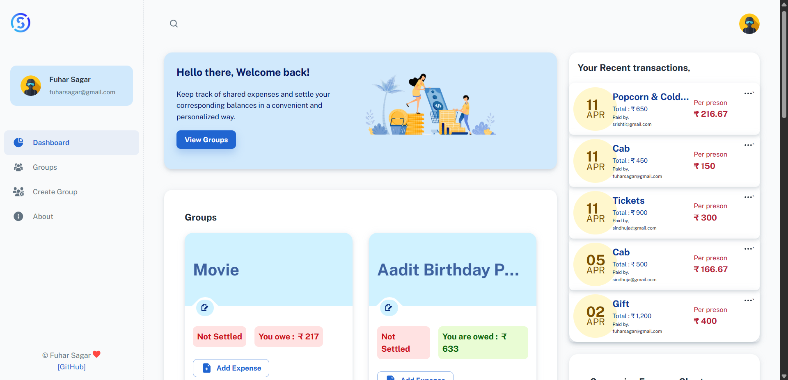
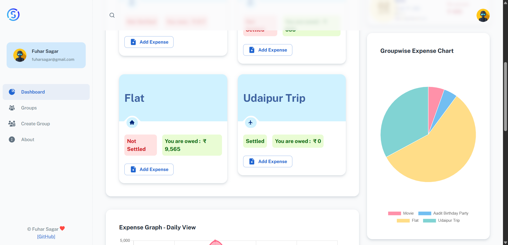
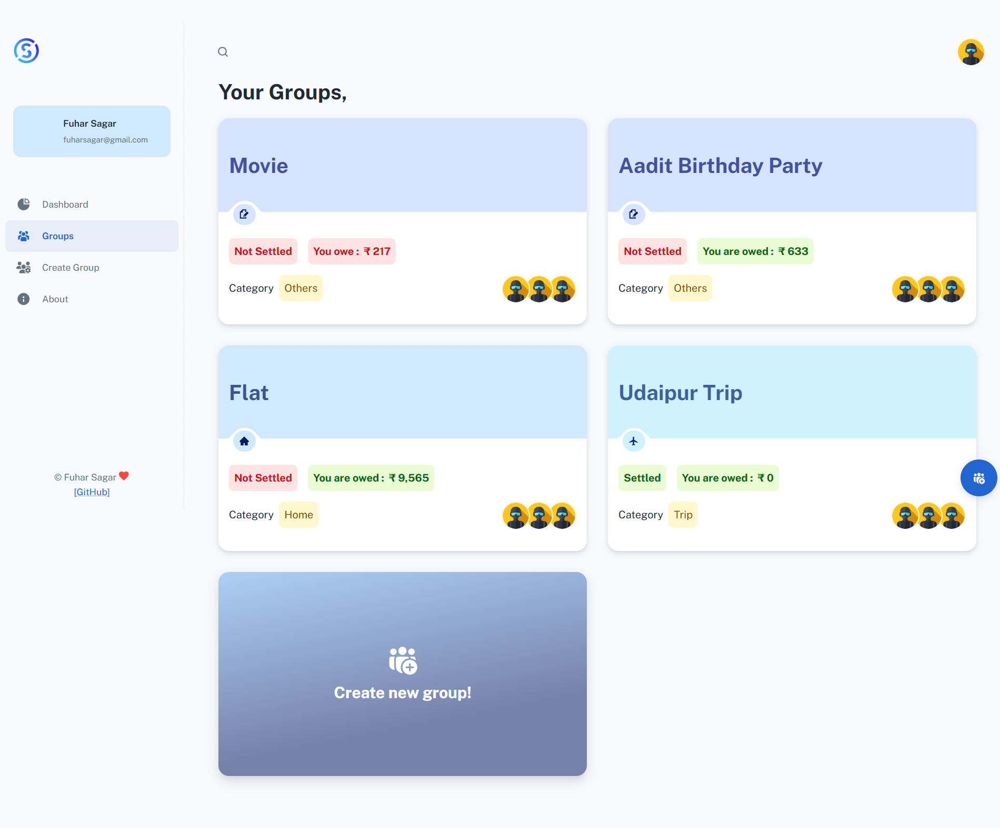

# SettleUp 💸

A full stack group expense splitting web application built with the MERN stack. Designed to help friend groups, flatmates, and travel groups to track shared expenses and settle balances easily .

## 🚀 Live Demo
https://settle-up-chi.vercel.app

## 📸 Screenshots
MAIN DASHBOARD :


CHARTS :          


GROUPS :                

            

## ✨ Features

- Create groups and track shared expenses between friends.
- Dashboard with real-time balance overview — who owes you and who you owe
- Settle up with group members directly from the app
- Category-wise expense pie charts and monthly spend graphs
- Group-wise expense analytics
- JWT-based authentication with bcrypt password encryption
- Responsive UI across desktop and mobile

## 🛠️ Tech Stack

**Frontend**
- React JS
- Redux (state management)
- Axios (API calls)
- Material UI (UI components)
- Chart.js + React-chartjs-2 (analytics graphs)

**Backend**
- Node.js
- Express.js
- JWT (authentication)
- bcryptjs (password encryption)

**Database**
- MongoDB (MongoDB Atlas)
- Mongoose (ODM)

## ⚙️ Setup & Installation

### Prerequisites
- Node.js installed
- MongoDB Atlas account

### Steps

1. Clone the repository
```bash
git clone https://github.com/fuhaaaar/settleup.git
cd settleup
```

2. Install backend dependencies
```bash
npm install
```

3. Create a `.env` file in the root directory
```
PORT=3001
MONGODB_URI=your_mongodb_atlas_connection_string
ACCESS_TOKEN_SECRET=your_secret_key
```

4. Install frontend dependencies
```bash
cd client
npm install
```

5. Run the app

In the root directory (backend):
```bash
npm start
```

In the client directory (frontend):
```bash
npm start
```

6. Open [http://localhost:3000](http://localhost:3000) in your browser

## 📁 Project Structure

```
settleup/
├── client/              # React frontend
│   ├── public/
│   └── src/
│       ├── components/  # UI components
│       ├── layouts/     # Dashboard layout
│       ├── services/    # API service calls
│       └── api/         # Axios instance
├── components/          # Backend controllers
├── model/               # MongoDB schemas
├── routes/              # Express API routes
├── helper/              # Auth & logging helpers
└── app.js               # Entry point
```

## 🔐 Environment Variables

| Variable | Description |
|---|---|
| `PORT` | Port for the backend server (default 3001) |
| `MONGODB_URI` | MongoDB Atlas connection string |
| `ACCESS_TOKEN_SECRET` | Secret key for JWT token generation |

## 📄 License

MIT License — Copyright 2026 Fuhar Sagar

---

⭐ If you found this project useful, consider giving it a star!
